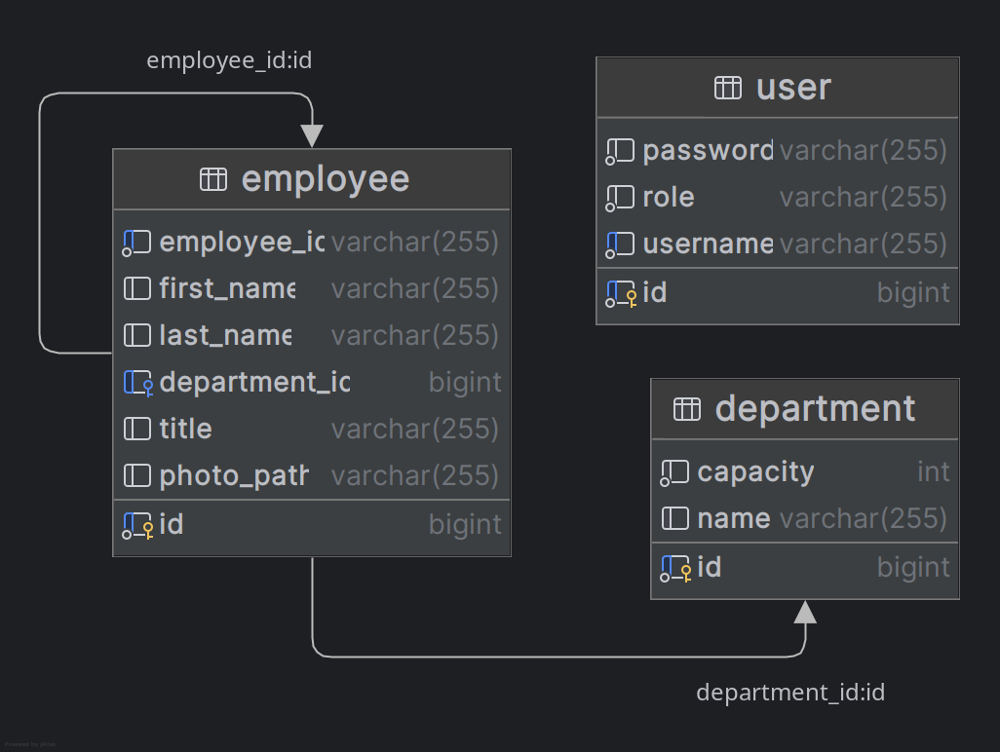
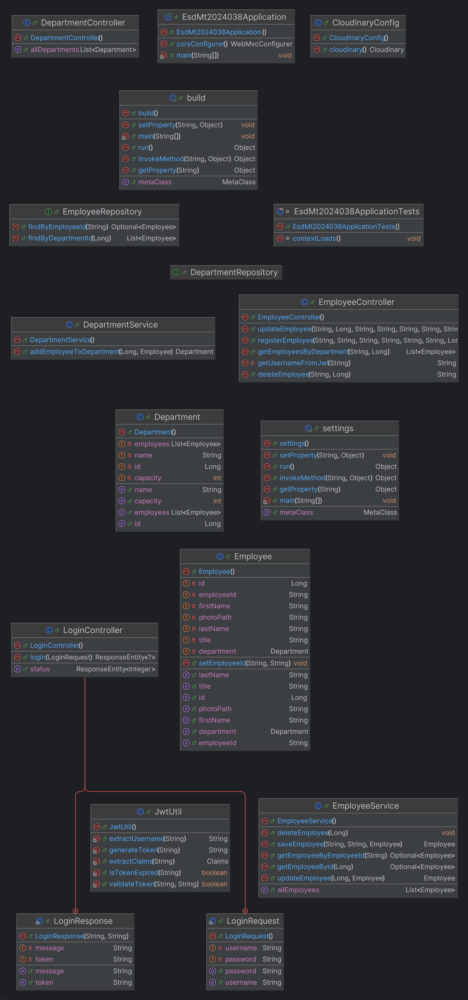

# ESD MiniProject

## Project Overview

This project is a mini project for the ESD (Enterprise Software Development) course. It involves both backend and frontend development to create a part of a bigger complete application.

## Backend Documentation

### Technologies Used

| Technology   | Description                                      |
|--------------|--------------------------------------------------|
| **Java**     | The primary programming language used for backend development. |
| **Spring Boot** | A framework to build and run the backend application. |
| **MySQL**    | The database used to store application data.     |
| **Gradle**   | Dependency management and build tool.            |
| **JWT**      | JSON Web Token for User Authentication and Validation. |

### Backend Setup Instructions

1. **Clone the repository**:
    ```sh
    git clone git@github.com:deepanshpandey/ESD_MiniProject.git
    ```

2. **Navigate to the project directory**:
    ```sh
    cd ESD_MiniProject
    ```

3. **Configure the database**:
    Update the `application.properties` file with your MySQL database credentials.

4. **Build the project**:
    ```sh
    cd BACKEND
    ./gradlew build
    ```

5. **Run the application**:
    ```sh
    ./gradlew bootRun
    ```

## Frontend Documentation

### Technologies Used

| Technology   | Description                                      |
|--------------|--------------------------------------------------|
| **React**    | The primary library used for building the user interface. |
| **Redux**    | State management library.                        |
| **Axios**    | HTTP client for making API requests.             |
| **Bootstrap**| CSS framework for styling.                       |

### Frontend Setup Instructions

1. **Navigate to the frontend directory**:
    ```sh
    cd FRONTEND
    ```

2. **Install dependencies**:
    ```sh
    npm install
    ```

3. **Start the development server**:
    ```sh
    npm start
    ```

### Key Components

| Component           | Description                                                      |
|---------------------|------------------------------------------------------------------|
| **App.js**          | The main component that includes routing and layout.             |
| **EmployeeForm.js** | Component to create or edit an Employee with form validation.    |
| **HomePage.js**     | Component for the home page displaying an overview of the application. |
| **AboutPage.js**    | Component for the about page providing information about the project. |
| **Login.js**        | Component for user login functionality.                          |
| **DepartmentService.js** | Middleware component serving DepartmentPage functionality. |
| **DepartmentPage.js** | Component for Department-wise Employee display and edit functionality. |
| **BackendStatus.js** | Component for Backend Service Status display functionality.     |
| **Footer.js**       | The footer component that contains the footer content.           |

## Backend UML Diagrams

### Class Diagram



### Sequence Diagram



<!-- ### Use Case Diagram

 -->

## Contributing

1. Fork the repository.
2. Create a new branch (`git checkout -b feature-branch`).
3. Make your changes.
4. Commit your changes (`git commit -m 'Add some feature'`).
5. Push to the branch (`git push origin feature-branch`).
6. Open a pull request.
